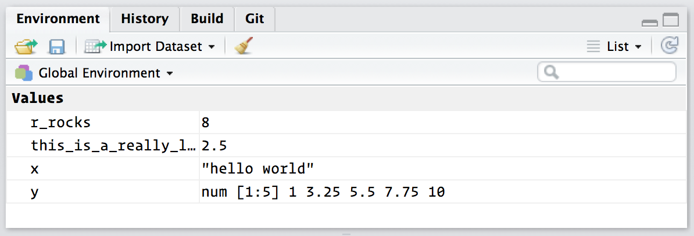

```{r setup, include=FALSE}
knitr::opts_chunk$set(echo = TRUE, fig.width = 7)
```

<style>
.column-left{
  float: left;
  width: 47.5%;
  text-align: left;
}
.column-right{
  float: right;
  width: 47.5%;
  text-align: left;
}
</style>


## Rの基本
プログラミング言語としてのRの基本的な文法について知っておきましょう。

## 電卓のように
```{r}
1 / 200 * 30
(59 + 73 + 2) / 3
sin(pi / 2)
```

## 変数の代入
```{r}
x <- 3 * 4
```

実は = でも代入できる

RStudioキーボード・ショートカット: Alt + -    

## 変数名
### 文法
変数名の先頭はアルファベット   
２字目以降はアルファベットor数字or_or.

大文字と小文字は区別される

### 代表的な名付けルール
- snake_case
- camelCase
- some.people.use.periods

### 補完
Rstudioでは入力途中でTABを押すと変数名が補完される

## print
```{r}
x
```

コンソールに変数名を入力すると自動的にprintが実行される。

```{r}
# 等価
print(x)
```

## 関数
```{r, eval=FALSE}
function_name(arg1 = val1, arg2 = val2, ...)
```

### help
```{r, eval=FALSE}
?sum
help(mean)
```

RStudioなら入力中にF1でも

## 文字列
```{r}
x <- "hello world"
y <- 'goodbye'
```

どっちでもどうぞ

### 引用符閉じ忘れ
- 引用符を閉じずにEnterすると \+ が出てくる。入力が継続している証拠
     - Escapeで離脱
- 入力待ち状態ならば\>が表示されている

## 変数リスト
Rstudioならば右上に現時点で作った変数のリストが表示される


