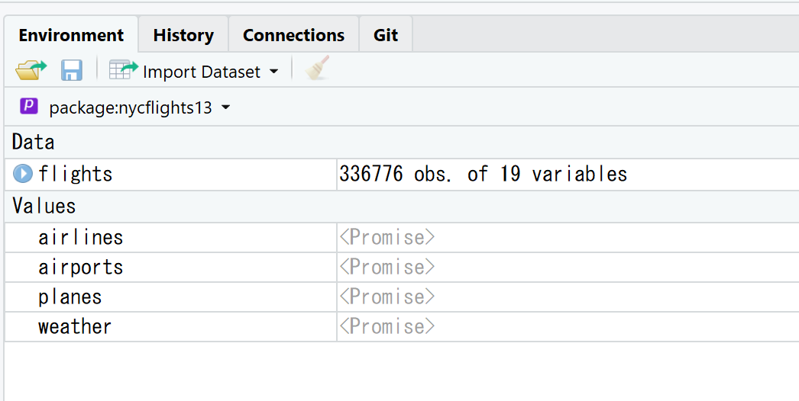

```{r setup, include=FALSE}
knitr::opts_chunk$set(echo = TRUE, warning = FALSE, message = FALSE, fig.width = 7)
```

<style>
.column-left{
  float: left;
  width: 47.5%;
  text-align: left;
}
.column-right{
  float: right;
  width: 47.5%;
  text-align: left;
}
</style>


## データ変換
持っているデータを必要な形に変形したり集計したりといったデータの基本操作

### dplyr
- データの基本操作を行うためのライブラリ
- `tidyverse`に含まれている
- 無人島に一つだけ持っていくライブラリを選ぶならこれかも
 
### 準備 
```{r load.dplyr, eval = FALSE}
install.packages("nycflights13")
library(nycflights13)
library(tidyverse)
```

```{r load2, include = FALSE}
library(nycflights13)
library(tidyverse)
```
 
## テストデータ
### `nycflights13::flights`
2013年にニューヨークの３つの空港から出発した336,776フライトのデータ
 
```{r nycflighs}
flights
```

## `View`
```{r view, eval = FALSE}
View(flights)
```

とすればデータの中身がGUIで見える（よく使う）

Rstudioの右上ペインのenvironmentからデータフレームをクリックしても起動



## データ変換の基本操作と`dplyr`の関数
- 行の絞り込み `filter()`
- ソート `arrange()`
- 列の選択 `select()`
- 既存の変数から新たな変数を作る `mutate()`
- 集計する `summarise()`

またこれらの関数の働き方をコントロールする`group_by()`

## `dplyr`関数の共通点(超重要)
`dplyr`の関数はすべて以下の共通点を持ちます。
この性質こそが`dplyr`が類を見ない強力な道具にする源泉です。

1. 一つ目の引数はデータフレームである
2. それ以降の引数はデータフレームする操作を表現する。データフレームが持つ変数を変数名そのまま表現できる
3. 関数の戻り値はデータフレームである

## 行の絞り込み `filter()`
```{r filtermonthday}
filter(flights, month == 1, day == 1)
```

## 論理演算
### 比較演算子
```
>, >=, <, <=, !=, ==
``` 
#### (注意)
浮動小数点の等号には関数`near`を使ってね

### 論理演算子
```
&, |, !
```

```{r logi, eval=FALSE}
filter(flights, month == 11 | month == 12)
```

### かなり便利なやつ
```{r pinp, eval = FALSE}
x %in% y
```

## `NA`
値が欠損していることを表す。

演算結果が少々トリッキー(ただし合理的)なので注意。

```{r na}
NA > 5
NA == NA
is.na(NA)
```

## `NA`のたとえ話
```{r na2}
# xを花子の年齢とする。彼女が何歳かは分からない。
x <- NA

# yを太郎の年齢とする。彼が何歳かは分からない。
y <- NA

# Q. 花子と太郎の年齢は同じだろうか？
x == y
```
分からない

## `NA`と`filter`
### `filter()`の性質
`filter()`は`TRUE`だけを残し、`FALSE`と`NA`は除く

### とてもとてもよく使う形
```{r filterisna, eval=FALSE}
filter(df, !is.na(val))
```

## 練習問題
1~4

## 行のソート `arrange()`
関数`arrange()`は行を昇順にソートします。
```{r arrange}
arrange(flights, year, month, day)
```

## 降順ソート
関数`desc()`をかませると降順になります。
```{r arrange.desc}
arrange(flights, desc(dep_delay))
```

## NAのソート
`NA`は昇順でも降順でも一番最後に並べられます。

## 練習問題
1~4

## 列の選択 `select()`
関数`select()`は列(変数)を選択します。
```{r select}
select(flights, year, month, day)
```

## 変数を範囲で指定
```{r select.colon}
select(flights, year:day)
```

## 除外する変数を指定
マイナスをつけると指定した変数以外の選択
```{r select.minus}
select(flights, -(year:day))
```

## 変数選択のヘルパー関数
- `starts_with("abc")`
- `ends_with("xyz")`
- `contains("ijk")`
- `matches("(.)\\1")`: 正規表現
- `num_range("x", 1:3)`
  
## `everything()`で列を全選択
列の順番を入れ替えるのに使える
```{r select.everything}
select(flights, time_hour, air_time, everything())
```


## 名前の変更 `rename()`
おおよそ一緒（並び順が違うけど）
```{r rename, eval=FALSE}
rename(flights, tail_num = tailnum)
select(flights, tail_num = tailnum, everything())
```


## メモ
`select()`以外でもヘルパー関数が使える場合あり

- `group_by`
- `tidyr::gather`
- `tidyr:nest`
- など

## 練習問題
1~4

## 列の追加 `mutate()`
既存の変数を使って新たな変数を作る
```{r mutate, eval = FALSE}
mutate(flights,
       year = year - 2000,
       gain = dep_delay - arr_delay,
       speed = distance / air_time * 60,
       gain_per_hour = gain / hour
)
```

- 上書きもできる
- 遅延評価

## 変形 `transmute()`
`mutate()`してその変数のみ`select`するの省略版
```{r transmute}
transmute(flights, 
          gain = dep_delay - arr_delay,
          hour = air_time / 60,
          gain_per_hour = gain / hour
)
```

## ベクトル演算
- Rの演算の多くがベクトル化されている
    - ベクトルin/ベクトルout 
- `mutate`の中でベクトル化された演算をしましょう
- ループよりも分かりやすい

## 基本のベクトル演算たち
- 四則演算 `+`, `-`, `*`, `/`, `^`
    - スカラー演算もできる `air_time / 60`
    - スカラー演算の応用 `y - mean(y)`
- 割り算 `%/%`, `%%`
    - `air_time %/% 60`
- `log()`, `log2()`, `log10()`, `exp()`
- 前にシフト`lead()`, 後ろにシフト`lag()`
- 論理演算 `<`, `<=`, `>`, `!=`, `==`
    - これらをさらにつないで `&`, `|`

## 累積計算
### 累積和
```{r cumsum}
x <- 1:10
x
cumsum(1:10)
```

### 他
- `cumprod()`, `cummin()`, `cummax()`, `cummean()`

## ランク
```{r rank}
y <- c(1, 2, 2, NA, 3, 4)
min_rank(y)
min_rank(desc(y))
row_number(y)
dense_rank(y)
percent_rank(y)
```

## よくやるパターン
```{r rownum}
mutate(flights, rn = row_number()) %>%
  select(rn, everything())
```
 
## 練習問題
1~6

## 集計 `summarise()`
縦方向に集計する
```{r summarise}
summarise(flights, delay = mean(dep_delay, na.rm = TRUE))
```

## グルーピング
集計の単位をコントロールする
```{r groupby}
by_day <- group_by(flights, year, month, day)
summarise(by_day, delay = mean(dep_delay, na.rm = TRUE))
```

ふつうは`group_by`と`summarise`とがセットになる

## 目的地ごとの距離と平均遅延時間
```{r calc.ave}
by_dest <- group_by(flights, dest) # 目的地でグルーピング
delay <- summarise(by_dest,  #集計する
                 count = n(), #行数を数える
                 dist = mean(distance, na.rm = TRUE), #平均距離
                 delay = mean(arr_delay, na.rm = TRUE) #平均遅延時間
)
delay <- filter(delay, count > 20, dest != "HNL") #データ数が少ないのは除外
```

変換されたオブジェクトを順番に作っていく

## パイプを使って書き直す 
```{r calc.ave.pipe}
delays <- flights %>% 
  group_by(dest) %>% #目的地でグルーピング
  summarise( #集計する
    count = n(), #行数を数える
    dist = mean(distance, na.rm = TRUE), #平均距離
    delay = mean(arr_delay, na.rm = TRUE) #平均遅延時間
  ) %>% 
  filter(count > 20, dest != "HNL") #データ数が少ないのは除外
```

*変換*にフォーカス！

## パイプ
### からくり
- `x %>% f(y)`は`f(x, y)`に自動変換される 
- `dplyr`関数の一つ目の引数と出力とが両方データフレームだから成立
    - 他の`tidyverse`の関数群も同様

### **絶対の絶対に身につける**
    - ソースコードの可読性が劇的に向上

### キーボードショートカット
- Ctrl + Shift + m (Rstudio)

## パイプを使って表現しなおす(再掲)
```{r calc.ave2}
by_dest <- group_by(flights, dest) 
delay <- summarise(by_dest, 
                 count = n(), 
                 dist = mean(distance, na.rm = TRUE), 
                 delay = mean(arr_delay, na.rm = TRUE) 
)
delay <- filter(delay, count > 20, dest != "HNL") 
```

```{r calc.ave.pipe2}
delays <- flights %>% 
  group_by(dest) %>% 
  summarise(
    count = n(),
    dist = mean(distance, na.rm = TRUE),
    delay = mean(arr_delay, na.rm = TRUE)
  ) %>% 
  filter(count > 20, dest != "HNL")
```


```{r flights.narm, echo=FALSE}
not_cancelled <- flights %>%
  filter(!is.na(dep_delay), !is.na(arr_delay))
```

<!--
## 平均を使って分析するときの注意
> 集計するときはカウントも残すことを習慣づけろ

Hadley神

## 機体ごとの平均遅れ時間の分布
```{r flights.freqpoly, fig.height=3}
not_cancelled %>%
  group_by(tailnum) %>%
  summarise(delay = mean(arr_delay)) %>%
  ggplot(mapping = aes(x = delay)) +
    geom_freqpoly(binwidth = 10)
```

平均300分遅れている機体が存在？

## データ数を見てみる
```{r flights.n, fig.height=3}
not_cancelled %>%
  group_by(tailnum) %>%
  summarise(delay = mean(arr_delay, na.rm = TRUE), n = n()) %>%
  ggplot(mapping = aes(x = n, y = delay)) +
    geom_point(alpha = 1/10)
```

データ数が少ないだけ！

## 平均値には注意、可視化してみる
```{r flights.n.filter, fig.height=3.5}
not_cancelled %>%
  group_by(tailnum) %>%
  summarise(delay = mean(arr_delay, na.rm = TRUE), n = n()) %>%
  filter(n > 25) %>%
  ggplot(mapping = aes(x = n, y = delay)) +
    geom_point(alpha = 1/10)
```
-->

## 集計関数とは
`summarise`の中ではベクトルin/スカラーoutの集計関数を使う

↕

`mutate`ではベクトルin/ベクトルoutのベクトル化関数を使う

## 集計関数`mean`
```{r mean.agg}
not_cancelled %>%
  group_by(year, month, day) %>%
  summarise(
    avg_delay1 = mean(arr_delay),
    avg_delay2 = mean(arr_delay[arr_delay > 0])
  )
```

## 集計関数`sd`
```{r sd}
not_cancelled %>%
  group_by(dest) %>%
  summarise(distance_sd = sd(distance)) %>%
  arrange(desc(distance_sd))
```

## 集計関数`min`,`max`
```{r minmax}
not_cancelled %>%
  group_by(year, month, day) %>%
  summarise(
    min_dep = min(dep_time),
    max_dep = max(dep_time)
  )
```

## 集計関数`first`,`last`
```{r firstlast}
not_cancelled %>%
  group_by(year, month, day) %>%
  summarise(
    first_dep = first(dep_time),
    last_dep = last(dep_time)
  )
```

## 集計関数`n_distinct`
```{r ndistinct}
not_cancelled %>%
  group_by(dest) %>%
  summarise(carriers = n_distinct(carrier)) %>%
  arrange(desc(carriers))
```

## 行のカウント関数`count`
```{r count, eval=FALSE}
not_cancelled %>%
  count(dest)
```

```{r summarise.count}
not_cancelled %>%
  group_by(dest) %>%
  summarise(n = n())
``` 

## `count()`で集計
```{r countwt, eval=FALSE}
not_cancelled %>%
  count(tailnum, wt = distance)
```
```{r summarise.sum}
not_cancelled %>%
  group_by(tailnum) %>%
  summarise(n = sum(distance))
```

## 論理変数の集計
論理変数を数値として扱う時、`TRUE`は1, `FALSE`は0になる。

```{r count.logic}
x <- 1:10
# xの要素で5より大きいものは？
x > 5
sum(x > 5) #xの要素で5を上回った個数
mean(x > 5) #xの要素で5を上回った割合
```

 
## `ungroup`
グループ変数を解除する関数`ungroup()`

### 個人の経験
グルーピングが残っていて動作がおかしくなることがよくある。
デバッグするとき注意して

### 結論
`group_by`したら放置しない。集計するか解除する

## 練習問題
1~6

## グルーピングしてfilter (1)
グループ内で上位ランクのみを抽出
```{r flightssml, echo=FALSE}
flights_sml <- flights %>%
  select(year:day, ends_with("delay"), distance, air_time)
```
```{r grouped.rank}
flights_sml %>%
  group_by(year, month, day) %>%
  filter(rank(desc(arr_delay)) <= 2)
```

## グルーピングしてfilter (2)
条件を満たすグループのみを抽出
```{r popular_dests}
popular_dests <- flights %>%
  group_by(dest) %>% filter(n() > 365)
popular_dests
```

## グルーピングしてmutate
```{r grouped.mutate}
popular_dests %>% 
  filter(arr_delay > 0) %>% 
  mutate(prop_delay = arr_delay / sum(arr_delay, na.rm = TRUE)) %>%
  select(year:day, dest, arr_delay, prop_delay)
```

## 練習問題
1~8

## 便利なサイト
- [いつもの](https://heavywatal.github.io/rstats/dplyr.html)
- [dplyrを使いこなす！基礎編](https://qiita.com/matsuou1/items/e995da273e3108e2338e)
    - SQLとの対応表あり
