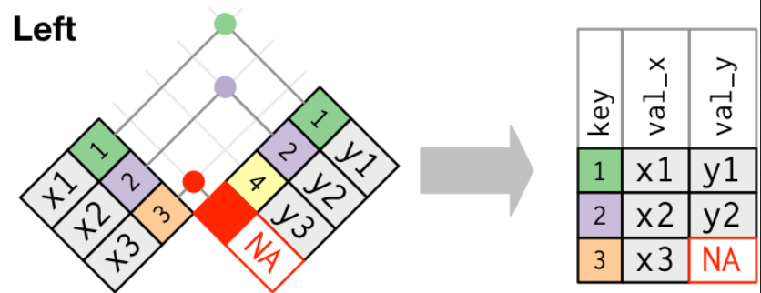

```{r setup, include=FALSE}
knitr::opts_chunk$set(echo = TRUE, fig.width = 7)
```

<style>
.column-left{
  float: left;
  width: 47.5%;
  text-align: left;
}
.column-right{
  float: right;
  width: 47.5%;
  text-align: left;
}
</style>


## 関係データ
複数のデータを併せて扱う技術

### Excelなら
vlookup

### SQLなら
JOIN

### 準備
```{r prereq, result = "hide"}
library(tidyverse)
library(dplyr)

library(nycflights13)
```

```{r load.diagrammer, include = FALSE}
library(DiagrammeR)
```

## 『関係』とは
### テーブルとテーブルとのつながり
<div align="center">
```{r two.table, echo = FALSE}
grViz("digraph dot{
  graph[rankdir = LR]
  node[shape = box]
  tableA -> tableB[arrowhead = none]
}", width = 500, height = 300)
```
</div>

## たくさんの間の関係
すべての関係は二者間の関係のあつまり

<div align="center">
```{r three, echo = FALSE}
grViz("digraph dot{
  graph[rankdir = TB]
  node[shape = box]
  mother -> son[arrowhead = none]
  mother -> daughter[arrowhead = none]
  grandma -> mother[arrowhead = none]
  {rank=same;son;daughter}
}", width = 700, height = 400)
```
</div>

## ３つのカテゴリ

- Mutating join
- Filtering join
- Set operation

SQLとコンセプトは似てる。

けど分析に特化して便利な道具立てをしているよ。

## `nycflights13`
- `airlines`
- `airports`
- `planes`
- `weather`

### ER図
<div align="center"></div>

## 練習問題
1~4

## キー
テーブル間を繋ぐ接続口

主キーと外部キーとの接続を『関係』とよぶ

- 主キー(primary key)
    - テーブルの中で一意
    - 主キーを持たないテーブルも存在
        - ログ
        - トランザクション
- 外部キー(foreign key)
    - 他のテーブルの中で一意

## 代理キー(surrogate key)
主キーが存在しないとき、人工的に追加する変数

```{r surrogatekey}
iris %>% mutate(sk = row_number())
```

## 練習問題
1~3

## Mutating joins

```{r, include FALSE}
flights2 <- flights %>% select(year:day, hour, origin, dest, tailnum, carrier)
```

二つのテーブルを結合し変数の種類数を増やす。

```{r leftjoin}
flights %>% 
  select(year:day, hour, tailnum, carrier) %>%
  left_join(airlines, by = "carrier")
```

## Four joins
- inner join
- left join
- right join
- full join

結果得られる変数は同じ。 
異なるのは得られる観測

<div align="center"></div>

## inner join
二つのテーブルに共に存在した観測のみを残す

```{r innerjoin, eval=FALSE}
inner_join(x, y, by = "key")
```

<div align="center"> </div>

## left join
左の観測はすべて残す

```{r leftjoin2, eval=FALSE}
left_join(x, y, by = "key")
```

<div align="center"></div>

originalのテーブルの観測をすべて残す


## 主キーは重複してはだめという話
<div align="center"></div>

観測が増殖する！

## キーの指定方法
- 自然ジョイン(natural join)
- キー指定
    - 変数名が同じ場合
    - 変数名が違う場合

## natural join
名前が同じ変数をキーとして採用

```{r naturaljoin}
flights2 %>% left_join(weather) 
```

あまりお勧めはしない

## single key
キーを直接指定

`year`に注目

```{r singlekey}
flights2 %>%
  left_join(planes, by = "tailnum")
```

## multiple key
複数のキーを同時指定もできる

```{r multikey}
flights2 %>%
  left_join(weather, by = c("year", "month", "day", "hour", "origin"))
```

## 異なる変数名のキー
```{r differentkey}
flights2 %>%
  left_join(airports, c("dest" = "faa"))
```

## 練習問題
1~5

## Filtering join
変数はいじらずに観測だけfilterする

- `semi_join(x, y)`
- `anti_join(x, y)`

## `semi_join`
```{r semijoin}
top_dest <- flights %>%
  count(dest, sort = TRUE) %>%
  head(10)
flights %>%
  semi_join(top_dest)
```

## `anti_join`
`semi_join`の逆

```{r antijoin}
flights %>%
  anti_join(planes, by = "tailnum") %>%
  count(tailnum, sort = TRUE)
```

## 練習問題
1~6

## 集合演算
- `intersect(x, y)`
- `union(x, y)`
- `setdiff(x, y)`

正直あんまり使わない

```{r setdiff}
train <- sample_n(flights, nrow(flights)*2/3)
test <- setdiff(flights, train)
```

## 参考サイト
[dplyrを使いこなす！JOIN編](https://qiita.com/matsuou1/items/b1bd9778610e3a586e71)
