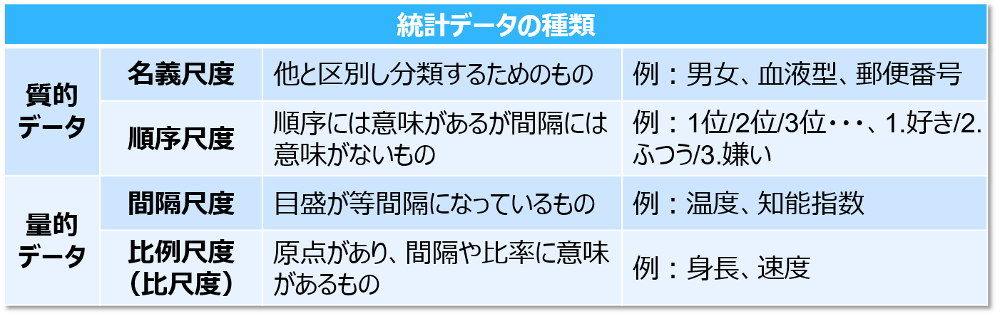

 
```{r setup, include=FALSE}
knitr::opts_chunk$set(echo = TRUE, fig.width = 7)
```

##  ファクタ
カテゴリ変数を扱う技術
 
### 準備
```{r prereq, results = "hide", message=FALSE, warning=FALSE}
library(tidyverse)
library(forcats)
```

神世界の一部だが、一括でロードはされない

関数はすべて`fct_`で始まる

## 尺度水準
そもそもカテゴリ変数とは？
 
<div align="center">

</div>

[wikipedia](https://en.wikipedia.org/wiki/Level_of_measurement)

## factor
```{r factor.basic}
x1 <- c("Dec", "Apr", "Jan", "Mar")
y1 <- factor(x1, levels = c("Jan", "Feb", "Mar", "Apr", "May", "Jun", "Jul", "Aug", "Sep", "Oct", "Nov", "Dec"))
y1
```

`levels`に存在しない要素は`NA`
```{r factor.na}
x2 <- c("Dec", "Apr", "Jam", "Mar")
y2 <- factor(x2, levels = c("Jan", "Feb", "Mar", "Apr", "May", "Jun", "Jul", "Aug", "Sep", "Oct", "Nov", "Dec"))
y2
```

## 順序のコントロール
順序指定なしだとアルファベット順
```{r factor.alphabet}
factor(x1)
```

最初に現れた順
```{r factor.inorder}
factor(x1, levels = unique(x1))
```

## levels
factorの`levels`を文字列ベクトルとして取得
```{r levels}
y1 <- factor(x1, levels = c("Jan", "Feb", "Mar", "Apr", "May", "Jun", "Jul", "Aug", "Sep", "Oct", "Nov", "Dec"))
levels(y1)
```

## 参考情報

- [尺度水準(wikipedia)](https://en.wikipedia.org/wiki/Level_of_measurement)
- [変数の尺度(統計ことはじめ)](https://bellcurve.jp/statistics/course/1562.html)