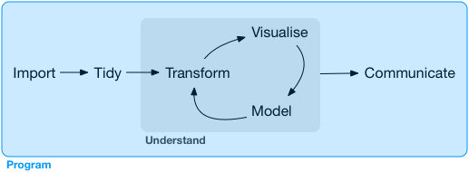

 
```{r setup, include=FALSE}
knitr::opts_chunk$set(echo = TRUE, fig.width = 7)
```

## Programming
データサイエンスが紙や鉛筆や電卓でできるか？ＮＯ

&rArr; データサイエンスのすべての工程でプログラミングが必要

<center></center>

### 神の御言葉
> プログラミングスキルを向上させることは長期投資と同じである

## プログラミングとは？
コミュニケーションの方法である
   
- コンピュータと
- 他の人と
- 未来の自分と

プログラミングが上手 = コミュニケーションが上手

## プログラミングの心がけ
- **書きやすい**ではなく**読みやすい**を
- **何を**したかだけでなく、**なぜ**そうしたかが伝わるように
- 伝えたいことを明瞭にするための書き直しをためらわない
    - 何度も書き直すのは良いこと
    - 後回しにせずにさっさと書き直す


## 目次
- パイプ
- 関数
    - コピペを避ける技術
- ベクトル
    - Rのデータ構造を理解する
- 反復
    - 入力を変えながら処理を繰り返す
   
