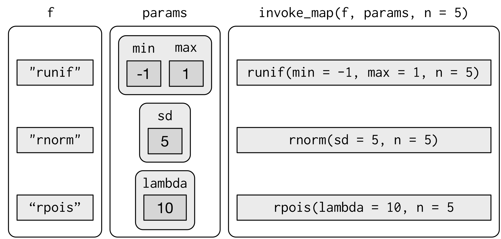

```{r setup, include=FALSE}
knitr::opts_chunk$set(echo = TRUE, fig.width = 7)
```

## Iteration
繰り返し作業を自動化するための二つの手法

1. ループ
2. 関数型プログラミング(functional programming)


## 準備
```{r prerequisites, message = FALSE}
library(tidyverse)
```

ループに関わるのは`base`ライブラリ

FPに関わるのは`purrr`ライブラリ

## 21.2 For loops
最も標準的なループ

## 例：各列のmedianを求める（ループなし）
```{r noloop, results="hide"}
df <- tibble(
	     a = rnorm(10),
	     b = rnorm(10),
	     c = rnorm(10),
	     d = rnorm(10)
) 
median(df$a)
median(df$b)
median(df$c)
median(df$d)
```

## 例：各行のmedianを求める（ループ）
```{r loop.median}
output <- vector("double", ncol(df))  # 1. output
for (i in seq_along(df)) {            # 2. sequence
  output[[i]] <- median(df[[i]])      # 3. body
}
output
```

## ループの構成要素 output
```{r loop.output, eval=FALSE}
output <- vector("double", ncol(df))
```

- ループの出力の器
- ループが始まる前に作る
   - `vector`関数で型と長さを指定する
   - 長さを指定しないと処理が遅くなる 

## ループの構成要素 sequence
```{r loop.sequence, eval=FALSE}
i in seq_along(df)
```

- どうループを回すか
- 一周するたびに`i`がベクトル`seq_along(df)`の中で値を変化させる
- `seq_along(df)`は`1:length(df)`と**ほぼ**同じ
    - 今回は`c(1,2,3,4)`
    - `length(df)`が`0`のときだけ違う


## ループの構成要素 body
```{r loop.body, eval=FALSE}
output[[i]] <- median(df[[i]])
```

- ループで実際に処理する内容
    - 1回目は`output[[1]] <- median(df[[1]])`
    - 2回目は`output[[2]] <- median(df[[2]])`
    - ...
 
## 21.2.1 Exercises
1を見てみる

## 21.3 For loop variations

1. オブジェクトを修正するループ（作成するのではなく）
2. 要素の名前や値で回すループ（インデックスではなく）
3. 出力の長さが不明の場合
4. ループ回数が不明の場合

## 21.3.1 Modifying an existing object
```{r modifying.loop}
df <- tibble(a = rnorm(10), b = rnorm(10), c = rnorm(10), d = rnorm(10))
rescale01 <- function(x) {
    rng <- range(x, na.rm = TRUE)
  (x - rng[1]) / (rng[2] - rng[1])
} 
df$a <- rescale01(df$a)
df$b <- rescale01(df$b)
df$c <- rescale01(df$c)
df$d <- rescale01(df$d)
```

### 等価
```{r modifying.loop2}
for (i in seq_along(df)) {
    df[[i]] <- rescale01(df[[i]])
}
```

## 21.3.2 Looping patterns
ループを回すときのsequenceの作法

1. `for (i in seq_along(xs))` インデックスとして1から順に数え上げる
     - 最も一般的かつ汎用的
2. `for (x in xs)` ベクトル`xs`の要素を一つずつとる
     - 出力を保存しにくい
          - オブジェクト操作でなく副作用(plot, writeなど)に使う
3. `for (nm in names(xs))` 要素の名前を一つずつとる
     - 要素の名前を使いたい場合
          - plotのタイトルとか

## インデックスを使った方法が最も汎用的
インデックスを使った方法は他の２つをシミュレートできる

```{r looping.sequence, eval=FALSE}
for (i in seq_along(x)) {
  name <- names(x)[[i]]
  value <- x[[i]]
}
```

## 21.3.3 Unknown output length
ループする前に出力の長さがわからないとき


## 乱数でベクトルの長さが変わる場合
### 下手な例
```{r unknown.output.length.ng}
means <- c(0, 1, 2)
output <- double()
for (i in seq_along(means)) {
  n <- sample(100, 1)
  output <- c(output, rnorm(n, means[[i]]))
}
```

毎回全データコピーするので$O(n^2)$の計算量がかかる

## 良い例
```{r unknown.output.length.ok}
out <- vector("list", length(means))
for (i in seq_along(means)) {
  n <- sample(100, 1)
  out[[i]] <- rnorm(n, means[[i]])
}
output <- unlist(out)
```

### 他の例
- `paste(out, x)`と追加していくのではなく、`out`をまとめて作ったあと`paste(out, collapse=TRUE)`でくっつける
- データフレームの行を追加していくのではなく、リストで作って`bind_rows(output)`でくっつける

## 21.3.4 Unknown sequence length
事前にループする回数がわからないとき

## `while`
```{r while.loop, eval=FALSE}
while (condition){
  #body
}
```

シミュレーションでよく使う

- 精度が出るまで反復する、とか

## 21.3.5 Exercises

## 21.4 For loops vs. functionals
関数型プログラミングとは

## for loopを使った例
```{r example.forloop}
df <- tibble(a = rnorm(10),
	     b = rnorm(10),
	     c = rnorm(10),
	     d = rnorm(10))

output <- vector("double", length(df))
for (i in seq_along(df)) {
    output[[i]] <- mean(df[[i]])
}
output
```

## 何回も使いそうだから関数にする
```{r example.functionalize}
col_mean <- function(df) {
    output <- vector("double", length(df))
  for (i in seq_along(df)) {
        output[i] <- mean(df[[i]])
    }
    output
}
```

## 平均以外の集計でも使うだろう
```{r example.func.var}
col_median <- function(df) {
    output <- vector("double", length(df))
  for (i in seq_along(df)) {
        output[i] <- median(df[[i]])
    }
    output
}
col_sd <- function(df) {
    output <- vector("double", length(df))
  for (i in seq_along(df)) {
        output[i] <- sd(df[[i]])
    }
    output
}
```

二回以上のコピペをしてしまった！

## 関数型プログラミング
```{r example.functionals, eval = FALSE}
col_summary <- function(df, fun) {
    out <- vector("double", length(df))
  for (i in seq_along(df)) {
        out[i] <- fun(df[[i]])
    }
    out
}
col_summary(df, median)
col_summary(df, sd)
```

Rでは関数の引数として関数を渡すことができる

$\Rightarrow$関数型プログラミング

## 21.4.1 Exercises
1,2

## 21.5 The map functions
for loopをfunctionalで置き換える関数`purrr::map`


## `purrr::map`
### Usage
```{r usage.map, eval=FALSE} 
map(.x, .f, ...)
```

### Arguments 
||
|---|---|
| **.x** | listかatomic vector |
| **.f** | 関数かformula |
| **...**| 関数に渡すパラメータ。たとえば`na.rm = TRUE`|

### return
ベクトル`.x`の要素をそれぞれ関数`.f`に適用し、その結果をリストで返す

## Example 1
```{r map.example1, eval=FALSE}
sheets <- c( "（NAP）全国",
	    "（NAP）関西",
	    "（NAP）関西以外")

poo <- map(sheets,
	   read_excel,
	   path = "input/★【weekly】POO_Flex_Histrical_Data.xlsx",
	   trim_ws = F)
```

## `map`一族
戻り値をリストではない形式に変換して返すこともできる

- `map` makes a list.
- `map_lgl` makes a logical vector.
- `map_int` makes an integer vector.
- `map_dbl` makes a double vector.
- `map_chr` makes a character vector.
- `map_df` makes a dataframe **特に重要**

これらが使えるかは`.f`の戻り値しだい

## Example 2
```{r map.example2, eval=FALSE}
sheets <- c( "（NAP）全国",
	    "（NAP）関西",
	    "（NAP）関西以外")

poo <- map_df(sheets,
	   read_excel,
	   path = "input/★【weekly】POO_Flex_Histrical_Data.xlsx",
	   trim_ws = F)
```
 
## `map`でやると何がいいのか
- 読みやすい、書きやすい
    - ループは本来処理したいことに対して余計なモノが多すぎる
- 処理が早い
    - と昔は言われていたが今はそうでもないらしい
    - 内部的にはCで処理しているから少し早い

## 21.5.1 Shortcuts
`map`を使う上でのテクニック

## 余裕のあるやり方
関数を定義する

```{r map.define.fun, eval=FALSE}
mylm <- function(df){
  lm(mpg ~ wt, data = df)
}
models <- mtcars %>%
  split(.$cyl) %>%
  map(mylm)
```

## せっかちなやり方
### 無名関数
```{r map.annonymous, eval=FALSE}
models <- mtcars %>%
  split(.$cyl) %>%
  map(function(df)lm(mpg ~ wt, data = df))
```

### formula
```{r map.formula}
models <- mtcars %>%
  split(.$cyl) %>%
  map(~lm(mpg ~ wt, data = .))
```

## Example 3
```{r map.example2, eval=FALSE}
sheets <- c( "（NAP）全国",
	    "（NAP）関西",
	    "（NAP）関西以外")

poo <- map_df(sheets,
	   ~read_excel(
	     sheet = .,
	     path = "input/★【weekly】POO_Flex_Histrical_Data.xlsx",
	     trim_ws = FALSE
	   ) %>% 
	     mutate(sheet_name = .)
	 ) 
```

## リストの各要素から情報を取り出す
```{r extract.r2}
models %>% 
  map(summary) %>% 
  map_dbl(~.$r.squared)
```

### shortcut
```{r extract.r2.sc, eval=FALSE}
models %>%
  map(summary) %>%
  map_dbl("r.squared")
```

## 21.5.2 BaseR
`lapply`, `sapply`, `vapply`という関数がbaseにある。

`map`を学べば不要

## 21.5.3 Exercises
全部自分でやらなければ身につかない

## 21.6 Dealing with failure
`map`関数を使ったプログラムのデバッグ技術

`map`中に一つエラーがあると全部出力しなくてむかつく

### for programmer
例外処理

## `purrr::safely`
関数`safely`は関数`.f`を引数として、`.f`を修正した関数を返す。

修正された関数は必ず長さ2のリストを返す関数で、その戻り値は下記の通り

1. 要素`result`は元々の関数`.f`の結果。ただしその結果がエラーだった場合は`NULL`
2. 要素`error`はエラーオブジェクト。`.f`の結果がエラーでなければ`NULL`

## Example 1
```{r example.safely}
safe_log <- safely(log)
safe_log(10)
safe_log("a")
```

## Example 2
```{r example.safely.map}
x <- list(1, 10, "a")
y <- x %>% map(safely(log))
str(y)
```

## `purrr::transpose`
関数`transpose`でもっと見易く

```{r example.transpose}
y <- y %>% transpose
str(y)
```

## 一族 `purrr::possibly`
関数`.f`がエラーのときに返す値を第二引数に指定できる。
```{r possibly}
possibly_log <- possibly(log, NA)
possibly_log(10)
possibly_log("a")
```

全くエラーを返さなくなる

## 21.7 Mapping over multiple arguments
複数入力の`map`

## `purrr::map2`
### Usage
```{r usage.map2, eval=FALSE} 
map2(.x, .y, .f, ...)
```

### Arguments 
||
|---|---|
| **.x** | listかatomic vector |
| **.y** | listかatomic vector。.xと.yとのそれぞれのベクトルの長さが同じでなければならない |
| **.f** | 関数かformula |
| **...**| 関数に渡すパラメータ。たとえば`na.rm = TRUE`|

### return
ベクトル`.x`,`.y`の要素をそれぞれ関数`.f`に適用し、その結果をリストで返す

## Example
```{r example.map2}
mu <- list(5, 10, -3)
sigma <- list(1, 5, 10)
map2(mu, sigma, rnorm, n = 5)
```

## Visualization of map2


## `purrr::pmap`
入力が３つ以上の場合

```{r example.pmap}
n <- list(1, 3, 5)
args2 <- list(mean = mu, sd = sigma, n = n)
args2 %>% pmap(rnorm) %>% str()
```

## Visualization of pmap


## これでもいいよ 
```{r example.pmap2}
params <- tribble(
		  ~mean, ~sd, ~n,
		  5,     1,   1,
		  10,    5,   3,
		  -3,    10,  5)
params %>% pmap(rnorm)
```

## 21.7.1 Involing different functions
入力変数だけでなく処理する関数すら変えたい場合

### Notes!!
現在`invoke_map`は非推奨になっている。`exec`で代用するべしとある

## `invoke_map`
関数名を文字列でわたす

```{r example.invokemap}
f <- c("runif", "rnorm", "rpois")
param <- list(
	      list(min = -1, max = 1), 
	      list(sd = 5), 
	      list(lambda = 10))
invoke_map(f, param, n = 5)
```

## Visualization of `invoke_map`


## `exec`で置き換え
```{r replace.exec, eval=FALSE}
# Before:
invoke_map(fns, list(args))
invoke_map(fns, list(args1, args2))

# After:
map(fns, exec, !!!args)
map2(fns, list(args1, args2), function(fn, args) exec(fn, !!!args))
```

[https://github.com/tidyverse/purrr/blob/master/NEWS.md#retirement-of-invoke](https://github.com/tidyverse/purrr/blob/master/NEWS.md#retirement-of-invoke)

## 21.8 Walk
副作用を目的にFPを

## `purrr::walk`
```{r example.walk}
x <- list(1, "a", 3) 

x %>% walk(print)
```

## `purrr::pwalk`
```{r example.pwalk, eval=FALSE}
plots <- mtcars %>% 
  split(.$cyl) %>% 
  map(~ggplot(., aes(mpg, wt)) + geom_point())
paths <- stringr::str_c(names(plots), ".pdf") 
pwalk(list(paths, plots), ggsave, path = tempdir())
```

## 21.9 Other patterns of for loops
FPのバリエーション

`map`ほどは使わないが頭のどこかに置いておくといいことがあるかもしれない

## 21.9.1 Predicate functions
入力関数として出力が論理値の関数を受け付けて特殊な動作をする

## `purrr::keep`と`purrr::discard`
入力ベクトルの要素のうち、関数の判定が`TRUE`の要素のみを残す（捨てる）

入力がデータフレームなら`dplyr::select_if`と同じ

```{r keep.discard}
iris %>% keep(is.factor) %>% str
iris %>% discard(is.factor) %>% str
```

## `purrr::some`と`purrr::every`
入力ベクトルの要素のうち、関数の判定がどれか（すべて）が`TRUE`なら`TRUE`

```{r some.every}
x <- list(1:5, letters, list(10))

x %>% some(is_character)
x %>% every(is_vector)
```

## `purrr::detect`
条件が成立する最初の要素の値を返す。

```{r detect}
x <- sample(10)
x
x %>% detect(~ . > 5)
x %>% detect_index(~ . > 5)
```

## `purrr::head_while`と`purrr::tail_while`
条件が成り立つまでの要素をすべて返す。

前から調べるか、後ろから調べるか

```{r head_while.tail_while}
x %>% head_while(~ . > 5)
x %>% tail_while(~ . > 5)
```

## 21.9.2 Reduce and accumulate
２入力１出力関数のみを受け付ける特殊な関数

２つの入力の順序を入れ替えても出力の値が変わらない場合が望ましい


## `purrr::reduce`
```{r reduce}
dfs <- list( age = tibble(name = "John", age = 30),
	    sex = tibble(name = c("John", "Mary"), sex = c("M", "F")),
	    trt = tibble(name = "Mary", treatment = "A"))
dfs %>% reduce(full_join)
```

## `purrr::accumulate`
```{r accumulate}
x <- sample(10)
x
x %>% accumulate(`+`)
```

## 21.9.3 Exercises
頭の訓練に


