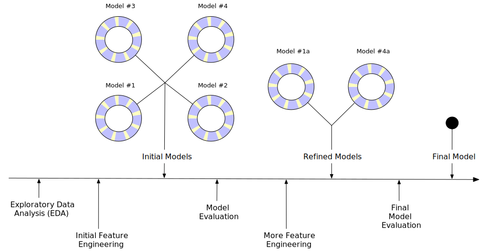

```{r setup, include=FALSE}
knitr::opts_chunk$set(echo = TRUE)
```

## Model  
```{r echo=FALSE, out.width="600px", fig.align='center'}
knitr::include_graphics("../img/data-science-model.png")
```

データ理解のための三本柱の最後の一本

### 目次
- model basics: モデルを作るための基礎知識
- model building: Rでモデルを作る技術
- many models: 複雑なデータをモデルを量産して理解する

## モデルの目的 
データをシグナルとノイズに分割する 

- シグナル：我々が興味のある対象のパターン
- ノイズ：我々には興味のない対象の確率的変動

### やらないこと
モデルの良し悪しを定量的に評価する

## モデルの分類
|Hadley表現|一般的な表現|機能概要|具体的な例|扱う？|
|---|---|---|---|---|
|予測的モデル|教師あり学習|予測を出力する|回帰、分類|扱う|
|発見的モデル|教師なし学習|データ間の関係を調べる|クラスタリング|扱わない|

## 仮説生成vs仮説検証
データ理解のための正統なワークフロー
```{r echo=FALSE, warning=FALSE}
library(DiagrammeR)
grViz('
digraph{
 subgraph tri{
   node[shape = box, style=rounded, fontname=Helvetica]
   rec1[label = "集計"]
   rec2[label = "可視化"]
   rec3[label = "仮説作る"] 
   rec1 -> rec2 [dir = both]
   rec1 -> rec3 [dir = forward]
   rec2 -> rec3 [dir = forward]
   {rank = same; rec1; rec2}
 }
 graph [rankdir=TB, layout = dot]
 node[shape = box, style=rounded, fontname=Helvetica]
 rec4[label = "仮説検証"]
 rec5[label = "理解！"]
 
 rec3 -> rec4 
 rec4 -> rec1 [xlabel = "ダメだった　"]
 rec4 -> rec2 [xlabel = "　ダメだった"]
 rec4 -> rec5 [label = "よかった！"]
}')
```

## 参考：高度なワークフロー
```{r echo=FALSE, fig.align='center'}

```

## モデル検証のためのデータの使い方
### データ三分の計

- 訓練データ (training) 
- 検証データ (query/validation) 
- テストデータ (test) 

硬派な立場ではある

## 参考
[Tidy Modeling with R](https://www.tmwr.org/)